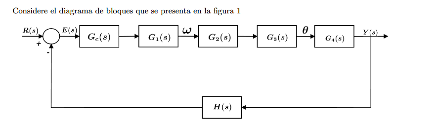

# Introduction to Automatic Control Project

## Abstract
The introductory project for the automatic control course involves the control of a 3D printer. This project includes designing a special compensator, controlling its actuator (a DC motor), the gearset connecting to the actuator, a block with angular velocity as input and angular displacement as output, a movable table model with a position sensor, as well as determining the open-loop and closed-loop transfer functions. The project also involves designing lead, lag, and lead-lag compensators to meet specific control objectives.

## Keywords
Transfer Function, Compensator, Control, Matlab

## Introduction
Control systems require careful design to achieve their primary objectives. In this project, we will design the control system for a 3D printer, primarily using Matlab to determine all the necessary components to achieve full control of the system. Here is the block diagram of the complete system:

Where Gc(s) represents the compensator block, G1(s) represents the transfer function of the DC motor given by:

\[G_{1}(s) = \frac{0.5}{s^{2}(\frac{3}{4})+s(\frac{13}{2})+1} \]

G2(s) is the transfer function of the gearset, given as:

\[G_{2}(s) = \frac{1}{4} \]

G3(s) is an integrator block with the input as angular velocity and the output as angular displacement:

\[G_{3}(s) = \frac{1}{s} \]

G4(s) represents the transfer function of the cart, given by:

\[G_{3}(s) = \frac{1}{Ms^2+Bs+k} = \frac{1}{s^2+s+2.5} \]

Finally, the negative feedback block H(s) represents the position sensor's transfer function:

\[H(s) = \frac{1}{s+1} \]

## Results

### Open-Loop Transfer Function
We calculated the open-loop transfer function by multiplying all the previously declared blocks and Gc(s). The result is:

\[G_{OL}(s) = \frac{0.5}{s^{2}(\frac{3}{4})+s(\frac{13}{2})+1} \times \frac{1}{4} \times \frac{1}{s} \times \frac{1}{s^2+s+2.5} \times \frac{1}{s+1} \]

### Steady-State Error
Steady-state error calculations were performed using the final value theorem. The open-loop transfer function error constants are as follows:

- Static error constant \(K_p = \infty\)
- Velocity error constant \(K_v = \frac{666668}{1333517}\)
- Acceleration error constant \(K_a = 0\)

For the closed-loop error constants:

- \(K_p = 1\)
- \(K_v = 0\)
- \(K_a = 0\)

The velocity error constant is approximately 20.0024.

### Root Locus
We used MATLAB to plot the root locus of the open-loop system, which showed the pole locations and allowed us to analyze the system's stability. The root locus for the open-loop system was obtained, and we also analyzed its step response.

The root locus for the closed-loop system was also calculated, and the system's step response was analyzed. We observed that the overshoot exceeded the allowed 10%, so we modified the root locus to meet the overshoot requirement.

### Lead Compensator
We designed a lead compensator to meet the system's overshoot requirement. The lead compensator was designed to have a specific overshoot value, and the MATLAB results were presented.

### Lag Compensator
We designed a lag compensator for the system. We selected a value for the parameter \(\beta\) to meet the overshoot requirement, and the MATLAB results were shown.

### Lead-Lag Compensator
A lead-lag compensator was designed to combine the characteristics of the lead and lag compensators. The MATLAB results and analysis were presented.

## Analysis of Results
Throughout the project, we progressively improved the closed-loop system by carefully choosing different compensators to meet the given requirements. However, we found that achieving the required settling time was impossible with any of the compensators. By analyzing the settling time requirement, we concluded that the lead compensator with 60 seconds meets the requirement after fine-tuning the constant.

## Conclusions
- We successfully completed all the project tasks, including the design and implementation of lead and lag compensators.
- We learned to use MATLAB as a fundamental simulation tool for control system analysis.
- We achieved a more accurate analysis using MATLAB's SISOTOOL, helping us fine-tune system parameters to meet specific control objectives.

## References
1. [Mathworks.com](https://www.mathworks.com/)
2. Ogata, Katsuhiko. "Ingeniería de Control Moderna," Prentice Hall, Madrid, 4th edition, 2003.
3. Dorf and R. H. Bishop. "Sistemas de Control Moderno," Pearson, 10th edition, 2008.

